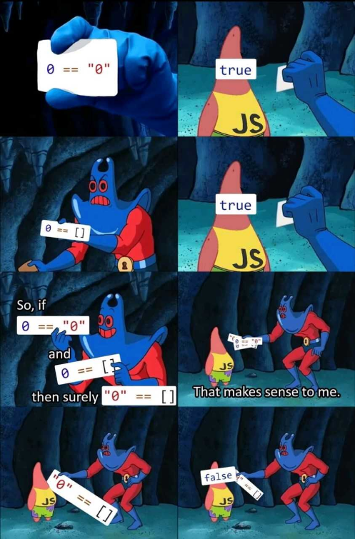

# isthisjavagw.js
No, it is not written in Java nor run on JVM. It is Node.js powered IoT Gateway for TI SensorTag.

## Background
This software was built for UNIHACK 2018 participants, provided by Bosch Australia. You may freely use this software outside the hackathon. Refer to [LICENSE.md](LICENSE.md) for license details.

Why in javascript?  

  

Mainly because during hackathons, I had noticed a good percentage of the projects involved Node.js and a lot of the graduates ended up writing applications that required knowledge of javascript in their first job.
The name.. Well.. It's an internal joke in the team since a lot of our gateway is JVM-based :(

## Features
isthisjavagw.js was buit for bluetooth connectivity to TI SensorTags and act as a middle-man software between your cloud application and SensorTag.

It is able to:
- Automatic device discovery and connection
- Enable/disable sensors
- Set period of each sensors
- Read I/O from SensorTag
- Poll sensor data and publish data
- Persistent device configuration
- Communication (2-way) between the API and gateway (that propagates to devices) via MQTT

## Getting Started
Edit the configurations to update MQTT and HTTP server to connect to, and (optionally, but recommended) change the device names to connect.
```
$ vim config.json
```
Install the node packages and start
```
$ npm i
$ npm start
```

## IMPORTANT FOR UNIHACK 2018
Things to keep in mind:
- If you would like to run this locally for your UNIHACK 2018, it is recommended to change the device name of the sensortags to something unique to your project. Refer to the guide PDF in the web guide for further details. Get help from Max if you get stuck.

## Authorship
Max Lee
Max.Lee@au.bosch.com | [Personal Blog](https://mallocsizeof.me)
